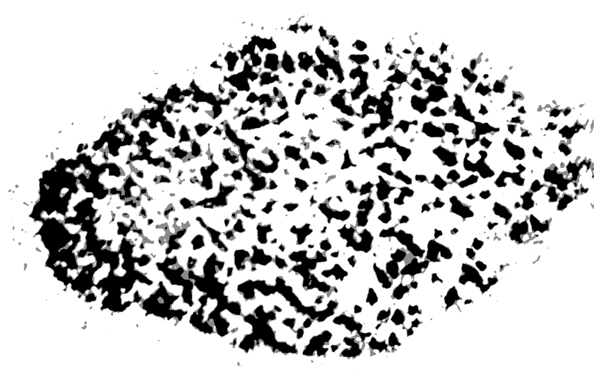

# Opportunity Designed Mark Copy Template

## Core statement

### What the mark means

A cloud, an inkblot, and a fingerprint, all at once.

**Cloud**  
See what others miss.

**Inkblot**  
Value what others overlook.

**Fingerprint**  
Own what's unmistakably yours.

## Short caption

The Opportunity Designed mark is a cloud, an inkblot, and a fingerprint, all at once: a symbol for seeing what others miss, valuing what others overlook, and owning what is unmistakably yours.

## Expanded version

The Opportunity Designed mark holds three ideas at once. The cloud is seeing what others miss. The inkblot is valuing what others overlook. The fingerprint is the outcome: owning what is unmistakably yours.

Together, they express how Opportunity Designed approaches growth: find the opportunity that is easy to miss, value what it holds, and turn it into a direction only your business can own.

## Component copy

| Element | Headline | Supporting copy |
| --- | --- | --- |
| Cloud | See what others miss. | Find the opportunity beyond the obvious answer. |
| Inkblot | Value what others overlook. | Reveal the potential hidden in unfamiliar territory. |
| Fingerprint | Own what's unmistakably yours. | Build a strategy shaped around the business only you can create. |

## Usage

- Use the **core statement** beside the three-part mark graphic or in a brand guide.
- Use the **short caption** for social posts, presentations, proposals, and website captions.
- Use the **expanded version** when introducing the brand story or explaining the mark to collaborators.
- Keep the three ideas in this order: cloud, inkblot, fingerprint.
- Do not describe the mark as having one fixed interpretation. Its meaning comes from holding all three ideas at once.

## Source asset

Local template copy: `Opportunity-Designed-Mark.png`  
Original master: `../mark/messy_check.png`
